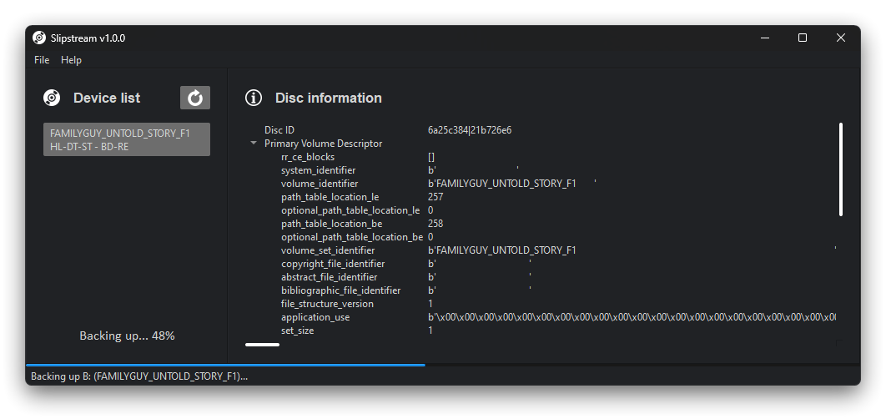

Slipstream's goal is to provide the user's a dead-simple process for backing up their legally owned home-media to a
wide array of formats, including a full backup. Slipstream can be used with it's GUI, as CLI, or as an importable
package.

It's trying to be different from the other solutions out there by providing as much information about the home-media
as one could need while being stupid simple to use.

## Installation

*Windows Installers are available on the [Releases] page.*

Alternatively you can download and install Slipstream from PIP/PyPI:

    $ pip install pslipstream

> **Note**
If pip gives you a warning about a path not being in your PATH environment variable then promptly add that path then
close all open command prompt Windows, or running `slipstream` won't work as it will not be recognized as a program.

Voilà 🎉 - You now have the `pslipstream` package installed!  
Launch it by typing `slipstream` in your Terminal or Windows Run.

  [Releases]: <https://github.com/rlaphoenix/slipstream/releases>

## To-do

- [X] Craft GUI with Qt.
- [x] Create a file based settings system.
- [x] Add drive selection option.
- [X] Add DVD backup support, using libdvdcss.
- [X] Add information window with details about the DVD ISO.
- [x] Write PyInstaller spec file.
- [ ] Add information window with details about the DVD-Video data, like Layer count, titles, languages, subtitles, codecs, e.t.c.
- [ ] Add support for remuxing to Matroska Video (MKV) with MKVToolnix.
- [ ] Add the ability to choose to remux by Title ID's.
- [ ] Add the ability to choose to remux by VOB ID, and VOB CELL's.
- [ ] Add the ability to choose which tracks of a title to output rather than all available.
- [ ] Add Blu-ray backup support, using libaacs.

## Licensing

This software is licensed under the terms of [GNU General Public License, Version 3.0](LICENSE).  
You can find a copy of the license in the LICENSE file in the root folder.

- [Music disc icons created by Freepik - Flaticon](https://www.flaticon.com/free-icons/music-disc)
- [Info icons created by Freepik - Flaticon](https://www.flaticon.com/free-icons/info)
- [Refresh icons created by Pixel perfect - Flaticon](https://www.flaticon.com/free-icons/refresh)

* * *

© rlaphoenix 2020-2023
