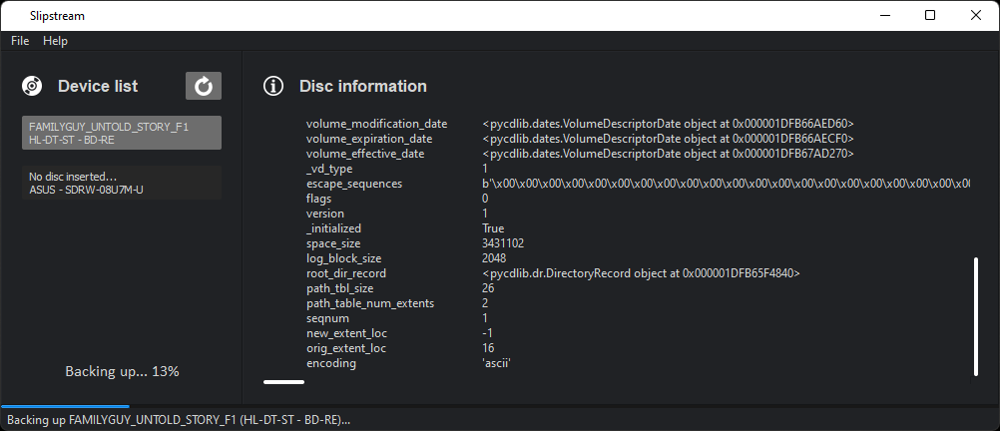

Slipstream's goal is to provide the user's a dead-simple process for backing up their legally owned home-media to a
wide array of formats, including a full backup. Slipstream can be used with it's GUI, as CLI, or as an importable
package.

It's trying to be different from the other solutions out there by providing as much information about the home-media
as one could need while being stupid simple to use.

  
*Preview as of June 2022.*

## Quick Installation

    python -m pip install --user pslipstream

You may also want to install from source, if so take a look at [Working with the Source Code](#working-with-the-source-code).

## To-do

- [X] Craft GUI with Qt.
- [x] Create a file based settings system.
- [x] Add drive selection option.
- [X] Add Linux support to the drive selection option.
- [X] Add DVD backup support, using libdvdcss.
- [X] Add information window with details about the DVD ISO.
- [x] Write PyInstaller spec file.
- [ ] Add information window with details about the DVD-Video data, like Layer count, titles, languages, subtitles, codecs, e.t.c.
- [ ] Add support for remuxing to Matroska Video (MKV) with MKVToolnix.
- [ ] Add the ability to choose to remux by Title ID's.
- [ ] Add the ability to choose to remux by VOB ID, and VOB CELL's.
- [ ] Add the ability to choose which tracks of a title to output rather than all available.
- [ ] Add Blu-ray backup support, using libaacs.

## Usage

To run Slipstream, type `slipstream` into Terminal, App Launcher, or Start Menu.

## Working with the Source Code

This project requires [Poetry], so feel free to take advantage and use it for its various conveniences like
building sdist/wheel packages, creating and managing dependencies, virtual environments, and more.

Note:

- Source Code may have changes that may be old, not yet tested or stable, or may have regressions.
- Only run or install from Source Code if you have a good reason. Examples would be to test for regressions, test
  changes (either your own or other contributors), or to research the code (agreeing to the [LICENSE](LICENSE)).
- [Poetry] is required as it's used as the [PEP 517] build system, virtual environment manager, dependency manager,
  and more.

  [Poetry]: <https://python-poetry.org/docs/#installation>
  [PEP 517]: <https://www.python.org/dev/peps/pep-0517>

### Install from Source Code

    git clone https://github.com/rlaphoenix/Slipstream.git
    cd Slipstream
    python -m pip install --user .

### Building source and wheel distributions

    poetry build

You can specify `-f` to build `sdist` or `wheel` only. Built files can be found in the `/dist` directory.

### Packing with PyInstaller

    python -m pip install --user pyinstaller
    poetry run python pyinstaller.py

The frozen build will be available in `/dist`. You may do both `.exe` and `Folder` builds. See `ONE_FILE` bool in `pyinstaller.py`.
