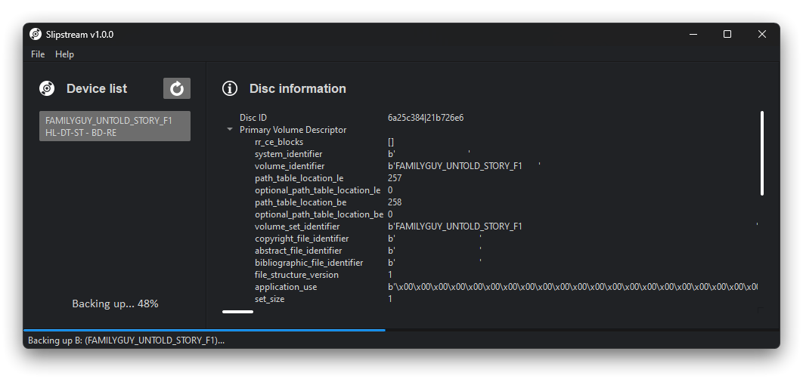

[](https://github.com/rlaphoenix/slipstream/blob/master/LICENSE)
[](https://www.python.org/)
[](https://github.com/astral-sh/uv)
[](https://github.com/astral-sh/ruff)
[](https://github.com/rlaphoenix/slipstream/actions/workflows/ci.yml)

Slipstream's goal is to provide the user's a dead-simple process for backing up their legally owned home-media to a
wide array of formats, including a full backup. Slipstream is a desktop GUI application.

It's trying to be different from the other solutions out there by providing as much information about the home-media
as one could need while being stupid simple to use.



## To-do

- [X] Craft GUI with Qt.
- [x] Create a file based settings system.
- [x] Add drive selection option.
- [X] Add DVD backup support, using libdvdcss.
- [X] Add information window with details about the DVD ISO.
- [x] Write PyInstaller spec file.
- [ ] Add information window with details about the DVD-Video data, like Layer count, titles, languages, subtitles, codecs, e.t.c.
- [ ] Add support for remuxing to Matroska Video (MKV) with MKVToolnix.
- [ ] Add the ability to choose to remux by Title ID's.
- [ ] Add the ability to choose to remux by VOB ID, and VOB CELL's.
- [ ] Add the ability to choose which tracks of a title to output rather than all available.
- [ ] Add Blu-ray backup support, using libaacs.

## Development

This project is managed using [uv](https://docs.astral.sh/uv), an extremely fast Python package and project manager.
Install the latest version of uv before continuing. Development currently requires Python 3.11+.

### Set up

Starting from Zero? Not sure where to begin? Here's steps on setting up this Python project using uv. Note that
uv installation instructions should be followed from the uv Docs: https://docs.astral.sh/uv/getting-started/installation

1. Clone the Repository:
    ```shell
    git clone --recurse-submodules https://github.com/rlaphoenix/slipstream
    cd slipstream
    ```
2. Install the Project with uv:
    ```shell
    uv sync --all-extras --all-groups
    ```
    This creates a Virtual environment at `.venv` and then installs all project dependencies and executables into the
    Virtual environment. Your System Python environment is not affected at all.
3. Now activate the Virtual environment:
    ```shell
    .venv\Scripts\activate
    ```
    (or `source .venv/bin/activate` on macOS and Linux)

    Note:
    - You can alternatively just prefix `uv run` to any command you wish to run under the Virtual environment.
    - I recommend entering the Virtual environment and all further instructions will have assumed you did.
    - JetBrains PyCharm and Visual Studio Code both detect the `.venv` Virtual environment automatically.
    - For more information, see: https://docs.astral.sh/uv/concepts/projects/
4. Install Pre-commit tooling to ensure safe and quality commits:
    ```shell
    uv tool install pre-commit --with pre-commit-uv --force-reinstall
    pre-commit install
    ```

Now feel free to work on the project however you like, all code will be checked before committing.
Launch the app with `uv run python -m pslipstream`.

If you make any changes to the QT UI file (`main_window.ui`), then you must run `.\make.ps1` to re-compile it to its
Python file.

### Packing with PyInstaller

    uv sync --group pack
    uv run python pyinstaller.py

You may do both `.exe` and `Folder` builds. See `--one-file` in `pyinstaller.py`.
The frozen build will be available in the `/dist` folder.

### Creating Windows Installers

1. Install the [Inno Setup Compiler](https://jrsoftware.org/isdl.php).
2. Right-click the [setup.iss](setup.iss) file in the root folder and click Compile. The version is read
   automatically from `pyproject.toml`.
3. The Windows Installer will be available in the `/dist` folder.

## Licensing

This software is licensed under the terms of [GNU General Public License, Version 3.0](LICENSE).  
You can find a copy of the license in the LICENSE file in the root folder.

- [Music disc icons created by Freepik - Flaticon](https://www.flaticon.com/free-icons/music-disc)
- [Info icons created by Freepik - Flaticon](https://www.flaticon.com/free-icons/info)
- [Refresh icons created by Pixel perfect - Flaticon](https://www.flaticon.com/free-icons/refresh)

* * *

© rlaphoenix 2020-2026
